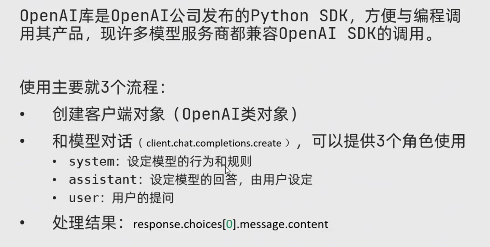

# OpenAI库基础使用笔记

## 什么是OpenAI库

OpenAI库是OpenAI公司发布的Python SDK，方便开发者通过编程方式调用其产品。目前许多模型服务提供商都兼容OpenAI SDK的调用方式，使其成为AI开发中的重要工具。



## 使用流程

使用OpenAI库主要包含以下3个流程：

### 1. 创建客户端对象

首先需要创建OpenAI类的客户端对象，用于与API进行交互。

### 2. 与模型对话

通过`client.chat.completions.create`方法与模型进行对话，可以使用以下3个角色：

- **system**：设定模型的行为和规则，定义模型的整体表现
- **assistant**：设定模型的回答，由用户预设，可以提供上下文信息
- **user**：用户的提问，是模型需要回应的内容

### 3. 处理结果

通过`response.choices[0].message.content`获取模型的回复内容，进行后续处理。

## 核心概念

- **客户端对象**：作为与OpenAI API交互的桥梁
- **角色设定**：通过不同角色的消息构建对话上下文
- **响应处理**：从API返回的响应中提取有用信息

## 应用场景

- 构建聊天机器人
- 生成文本内容
- 回答问题
- 辅助编程
- 内容摘要生成

## 代码示例

```python
import os
from openai import OpenAI

# 创建客户端对象
client = OpenAI(api_key="your-api-key")

# 与模型对话
response = client.chat.completions.create(
    model="gpt-3.5-turbo",
    messages=[
        {"role": "system", "content": "你是一个 helpful 的助手"},
        {"role": "user", "content": "什么是OpenAI库？"}
    ]
)

# 处理结果
print(response.choices[0].message.content)
```

## 注意事项

- 需要设置有效的API密钥
- 注意模型的使用限制和费用
- 合理构建对话上下文以获得更好的结果
- 处理API响应时要考虑错误处理

## 总结

OpenAI库提供了一种简洁高效的方式与AI模型进行交互，通过遵循创建客户端、构建对话、处理结果的流程，可以快速实现各种AI应用。掌握这些基础使用方法，是进行更复杂AI开发的基础。