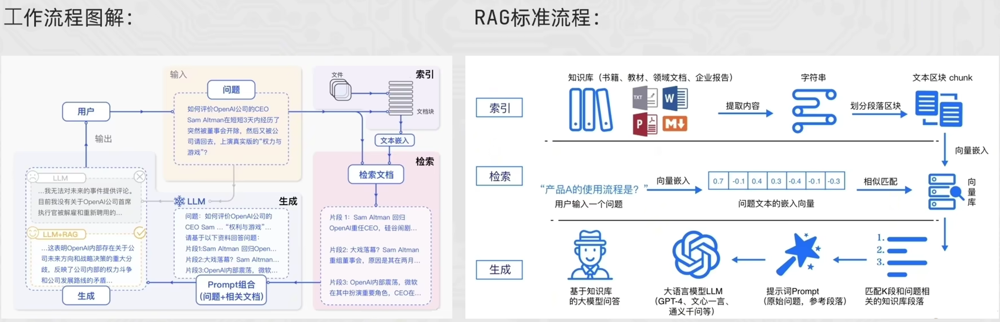
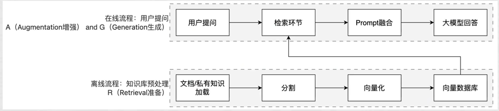

# RAG技术详解

## 什么是RAG

RAG（Retrieval-Augmented Generation，检索增强生成）是一种将强大的信息检索（Information Retrieval，IR）技术与生成式大语言模型（LLM）相结合的框架。

RAG的核心思想是：让LLM在回答问题时，先从外部知识库中检索相关内容，再基于检索结果生成回答，而不是仅依赖模型训练时记住的知识。这解决了LLM的两个核心痛点：**知识截止日期**（模型不知道训练后发生的事）和**幻觉问题**（模型在不确定时会编造答案）。

RAG的完整请求流程如下：

1. **用户提问**：用户输入自然语言问题
2. **Embedding转换**：问题经过Embedding模型转为查询向量
3. **向量数据库检索**：在向量数据库中进行相似度检索，找到Top-K最相关的文档块
4. **Prompt拼接**：将问题与检索到的文档块拼接成上下文
5. **LLM生成**：基于检索结果作答，生成最终回答



## 为什么需要RAG

尽管LLM本身拥有海量的知识，但它依然面临三个核心挑战，而RAG正是解决这些挑战的有效方案：

### 1. 解决知识时效性问题（对抗"知识截止"）

预训练的LLM的知识被固化在其训练数据的截止时间点（Knowledge Cutoff）。例如，GPT-4的知识库可能截止于2023年12月。对于此后发生的新事件、新知识，LLM无法直接给出准确答案。

RAG通过**动态检索外部知识源**，为LLM提供"实时"的知识补充，从而克服了知识过时的问题。

### 2. 打通私有数据访问（支撑企业级应用）

出于数据安全和商业机密的考虑，企业内部的**私有数据**（如产品文档、内部知识库、客户数据等）无法被公开的LLM直接访问。

RAG技术能够安全地连接这些私有数据源，在用户提问时，仅将与问题相关的片段信息提取出来提供给LLM，使其能够在**不泄露全部数据**的前提下，基于企业自身的知识进行回答，实现真正可用的企业级智能应用。

### 3. 提升回答的准确性与可追溯性（对抗"模型幻觉"）

LLM有时会产生"幻觉（Hallucination）"，即编造不符合事实的信息。

RAG通过提供明确的、有据可查的参考文本，强制LLM的回答**基于检索到的事实**，大大降低了幻觉的发生率。同时，由于可以展示引用的原文，使得答案的**来源可追溯、可验证**，增强了系统的可靠性和用户的信任度。

## RAG工作流程

RAG的工作流程由两条流水线组成：**离线索引流水线**（将文档预处理存入向量库）和**在线查询流水线**（接收用户问题、检索、生成）。



### 离线索引流水线（一次性预处理）

离线阶段将原始文档切分成小块，通过Embedding模型转换为向量，存入向量数据库：

1. **原始文档处理**：对文档进行切分和清洗
2. **Embedding转换**：将文档块通过Embedding模型转为文档向量
3. **写入向量数据库**：将向量写入向量数据库存储

### 在线查询流水线（每次请求都会经过）

在线阶段将用户问题同样转换为向量，从数据库中找到最相近的文档块，拼接成上下文交给LLM生成答案：

1. **用户提问**
2. **Embedding转查询向量**
3. **向量数据库相似度检索Top-K**
4. **Prompt拼接**：问题+文档块
5. **LLM生成**：基于检索结果作答

## 数据预处理与文档切分（Chunking）

### 前置挑战：复杂文档解析

在进行切分前，RAG往往面临着格式解析的挑战。特别是PDF、Word或扫描件中的表格、图片和多栏排版，普通的文本提取极易造成语义错乱。

目前行业主流方案是引入**文档解析引擎**（如LlamaParse、Unstructured）或多模态大模型，将复杂图文转换为结构化的Markdown，为后续高质量切分打下基础。

### 文档切分策略

文档切分是RAG效果的基础，切分粒度直接影响检索质量。**块太大会引入噪声，块太小会丢失上下文**。常用策略如下：

| 切分策略 | 适用场景 | 优点 | 缺点 |
|---------|---------|------|------|
| **固定大小切分** | 通用文本 | 实现简单，速度快 | 可能切断语义完整的句子 |
| **递归字符切分** | 结构化文本（Markdown、代码） | 优先按段落、句子等语义边界切分 | 实现略复杂，需设定合理的分隔符列表 |
| **语义切分 (Semantic)** | 长文档、书籍 | 利用Embedding计算相邻句子的相似度，自动寻找语义转折点切分 | 计算成本高，预处理速度慢 |
| **父子文档检索 (Small-to-Big)** | 全面覆盖场景 | 用"小块"进行高精度向量检索，命中后返回对应的"大块"（父文档）给LLM，兼顾了检索精度和上下文完整性 | 数据库设计和维护成本翻倍 |

**实践中常在切分时加入重叠（overlap）**，即相邻块之间共享若干字符，防止重要信息在边界处被截断。

**典型配置**：块大小512 tokens，重叠50~100 tokens。

### 代码示例：使用LangChain进行递归切分

```python
from langchain.text_splitter import RecursiveCharacterTextSplitter

splitter = RecursiveCharacterTextSplitter(
    chunk_size=512,        # 每块最大token数
    chunk_overlap=50,      # 相邻块的重叠token数，防止信息在边界处丢失
    separators=["\n\n", "\n", "。", ".", " ", ""]  # 优先按段落、句子切分
)

chunks = splitter.split_text(document_text)
print(f"切分为 {len(chunks)} 个文档块")
```

## 向量检索

### Embedding模型

Embedding模型负责将文本转换为稠密向量（通常是768或1536维的浮点数数组）。语义相近的文本在向量空间中距离更近，这正是相似度检索的数学基础。

**常用Embedding模型对比**：

| 模型 | 维度 | 适用语言 | 特点 |
|------|------|---------|------|
| text-embedding-3-small（OpenAI） | 1536 | 多语言 | 性价比高，适合大规模索引 |
| text-embedding-3-large（OpenAI） | 3072 | 多语言 | 精度最高，成本较高 |
| BAAI/bge-m3 | 1024 | 中英文 | 开源，中文效果优秀，支持多语言 |
| sentence-transformers/all-MiniLM-L6-v2 | 384 | 英文 | 体积小，速度快，适合本地极轻量部署 |

### 相似度计算与ANN算法

检索的核心是度量距离。最常用的是**余弦相似度（Cosine Similarity）**，它计算两个向量夹角的余弦值，范围在-1到1之间，值越接近1表示越相似。

除了余弦相似度，还有**欧氏距离**和**点积**等计算方式。

对于大规模向量数据库，精确的相似度计算成本过高，通常采用**近似最近邻（ANN）算法**来加速检索，常见的索引结构包括：

- **HNSW（Hierarchical Navigable Small World）**：一种基于图的索引结构，具有较高的检索精度和较快的检索速度
- **IVF（Inverted File Index）**：倒排索引，通过聚类来加速检索
- **PQ（Product Quantization）**：乘积量化，通过压缩向量来减少存储和计算成本

### 检索策略

- **Top-K检索**：通常检索5-10个最相似的文档块
- **相似度阈值**：设置合适的相似度阈值（如0.7），过滤掉不相关的结果
- **混合检索**：结合关键词检索（如BM25）和向量检索，提高检索的准确性
- **重排序**：对检索结果进行重排序（如使用Cross-Encoder），确保最相关的内容排在前面

## RAG与传统搜索引擎的区别

| 维度 | 传统搜索（搜索框） | RAG（检索+生成） |
|------|------------------|-----------------|
| **用户目标** | 找到文档/页面/附件 | 直接得到可读答案/总结/对比结论 |
| **延迟与成本** | 低、易扩展 | 更高（检索+LLM推理） |
| **可控性/可审计** | 强：给原文链接 | 弱一些：可能误解/遗漏细节 |

**为什么有些企业还是宁愿用传统搜索而不是RAG？**

因为RAG存在**推理成本和响应延迟**的问题。在某些纯粹为了"找文件"而非"总结答案"的简单场景，传统搜索依然具备极致的效率优势。

## RAG的常见用途

RAG最适合用在"答案依赖外部资料、且资料会变化/很长"的场景：先从知识库检索相关内容，再让大模型基于检索结果生成回答，从而减少胡编、提升可追溯性。

### 典型应用场景

1. **客服机器人**：基于产品知识库做问答、排障、流程引导
   - 例："如何退换货/开发票？""某型号设备报错码怎么处理？"

2. **研发/运维 Copilot**：检索代码库、接口文档、告警手册，辅助定位问题与生成修复建议

3. **医疗助手**：检索指南/药品说明/院内规范后生成辅助建议（不做最终诊断）
   - 例："某药禁忌是什么？""依据指南解释检查指标含义"

4. **法律咨询**：基于法规条文/案例/合同模板检索，生成条款解释与风险提示
   - 例："违约金如何计算？""不可抗力条款怎么写更稳妥？"

5. **教育辅导**：从教材/讲义/题库检索知识点，生成讲解与例题步骤
   - 例："这道题对应哪个公式？怎么推导？"

6. **企业内部助手**：连接制度、SOP、会议纪要、技术文档做检索/总结/对比
   - 例："某流程最新版本是什么？""对比两份方案差异并给结论"

7. **其他**：投研/合规/审计（报告/披露/内控）；销售/方案支持（产品手册/标书模板、生成方案并标注出处）

## RAG的核心优势和局限性

### 核心优势

| 优势 | 说明 |
|------|------|
| **知识更新成本低** | 只需更新知识库，无需重新训练模型，大大降低了维护成本 |
| **可解释性强** | 可以引用检索到的源文档，提高回答的可信度和可解释性 |
| **领域适应性好** | 通过更换知识库，可以快速适应不同领域的需求 |
| **降低幻觉** | 基于真实文档生成回答，减少模型生成错误信息的可能性 |
| **灵活性高** | 可以根据具体应用场景调整各个组件，优化系统性能 |

### 局限性

| 局限 | 说明 |
|------|------|
| **检索质量依赖** | 检索结果的质量直接影响生成回答的质量 |
| **上下文窗口限制** | 模型对输入长度有限制，过多的检索内容需要截断 |
| **复杂推理受限** | 对于需要多步推理的问题，RAG效果可能不佳 |
| **实时性挑战** | 文档更新后需要重新索引，有一定延迟 |
| **多语言场景** | 不同语言的嵌入模型和检索效果可能存在差异 |

## RAG的关键组件详解

### 1. 文本分割策略

- **分割方法**：按固定长度、按段落、按句子、按语义等
- **重叠设置**：相邻块之间共享若干字符（通常10-20%）
- **块大小**：一般在100-1000 tokens之间，根据场景调整
- **语义完整性**：尽量保持语义的完整性

### 2. 嵌入模型

- **模型类型**：通用嵌入模型 vs 领域特定嵌入模型
- **多语言支持**：是否支持多语言处理
- **向量维度**：768-3072维不等
- **性能权衡**：嵌入质量和计算成本的平衡

### 3. 向量数据库

- **类型**：云服务（Pinecone、Weaviate）vs 本地部署（Milvus、Faiss）
- **索引类型**：HNSW、IVF、PQ等
- **扩展性**：支持不断增长的知识库
- **查询性能**：直接影响系统响应时间

### 4. 检索策略

- **检索数量**：Top-K中的K值设置
- **相似度阈值**：过滤低相关度结果
- **混合检索**：结合多种检索方式
- **重排序**：优化检索结果顺序

### 5. Prompt设计

- **结构**：问题描述+检索信息+回答要求
- **格式**：清晰的格式有助于模型理解
- **长度限制**：考虑上下文窗口限制
- **指令优化**：引导模型充分利用检索信息

## RAG的未来发展趋势

### 1. 多模态RAG

- **图像、视频等多模态内容的整合**：不仅检索文本，还能检索图像、视频等多模态内容
- **跨模态理解**：提高模型对不同模态内容的理解和整合能力

### 2. 自适应RAG

- **动态调整**：根据不同的问题类型和上下文，自动调整检索策略和参数
- **持续学习**：通过用户反馈不断优化检索和生成过程

### 3. 结构化知识融合

- **知识图谱整合**：将结构化的知识图谱与非结构化文本相结合
- **推理能力增强**：提高模型基于检索信息进行推理的能力

### 4. 分布式RAG

- **大规模知识处理**：处理更大规模的知识库
- **并行计算**：通过分布式计算提高检索和生成速度

### 5. 隐私保护RAG

- **本地部署**：在本地环境部署RAG系统，保护敏感信息
- **联邦学习**：在保护数据隐私的前提下进行模型优化

## 总结

RAG技术通过结合检索和生成，为大语言模型提供了一种有效的知识增强方法。它不仅解决了模型知识时效性和准确性的问题，还为模型提供了可解释性和领域适应性。

RAG的核心价值在于：
- **解决知识截止问题**：让模型能够获取最新信息
- **打通私有数据**：实现企业级知识应用
- **减少幻觉**：提供可追溯、可验证的回答

随着向量数据库和嵌入模型的不断发展，RAG技术在未来将发挥更加重要的作用。它将为各种应用场景提供更智能、更可靠的AI解决方案，从企业知识管理到客户支持，从教育到研究，都将受益于这一技术的进步。

掌握RAG技术的原理和应用，对于从事AI开发和应用的专业人士来说，将成为一项重要的技能。通过不断优化RAG系统的各个组件，我们可以构建更加智能、高效的AI应用，为用户提供更好的服务和体验。