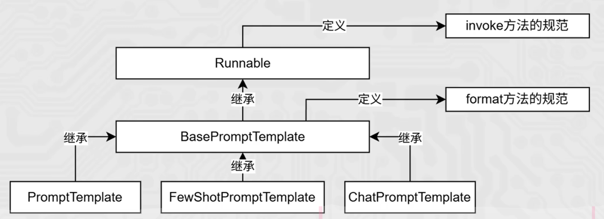

# Prompt模板详解

## Prompt模板继承关系

Prompt模板是LangChain中用于构建和管理提示词的核心组件，它们之间存在明确的继承关系。从继承关系图中可以看出，整个体系以`Runnable`为基础，通过继承实现了不同类型的Prompt模板。



## 核心方法：invoke vs format

### format方法

**format方法**是由`BasePromptTemplate`定义的规范，用于将模板与变量结合，生成最终的提示词文本。

- **作用**：将模板中的占位符替换为具体的值，生成完整的提示词字符串
- **输入**：包含变量值的字典
- **输出**：字符串形式的完整提示词
- **使用场景**：当你需要获取最终的提示词文本，而不需要立即执行时

### invoke方法

**invoke方法**是由`Runnable`定义的规范，用于执行模板并返回结果。

- **作用**：执行提示词模板，处理变量替换，并返回执行结果
- **输入**：包含变量值的字典，可选的配置参数
- **输出**：执行结果（通常是LLM的响应）
- **使用场景**：当你需要直接执行提示词并获取模型响应时

### 区别对比

| 方法 | 定义来源 | 作用 | 输出 | 使用场景 |
|------|---------|------|------|----------|
| **format** | BasePromptTemplate | 生成提示词文本 | 字符串 | 需要获取提示词文本时 |
| **invoke** | Runnable | 执行提示词并获取结果 | 模型响应 | 需要直接获取模型回答时 |

## 三种Prompt模板详解

### 1. PromptTemplate

**PromptTemplate**是最基础的提示词模板，用于创建简单的文本提示词。

#### 特点
- 适用于单轮对话
- 生成纯文本提示词
- 支持变量替换

#### 代码示例

```python
from langchain.prompts import PromptTemplate

# 创建模板
template = "请解释什么是{topic}，并提供3个应用场景。"
prompt = PromptTemplate(template=template, input_variables=["topic"])

# 使用format方法生成提示词文本
prompt_text = prompt.format(topic="RAG技术")
print("格式化后的提示词:")
print(prompt_text)

# 使用invoke方法执行提示词
# (需要结合LLM使用)
```

### 2. FewShotPromptTemplate

**FewShotPromptTemplate**用于创建少样本提示词，通过提供示例来指导模型生成更符合预期的结果。

#### 特点
- 包含示例部分和模板部分
- 适用于需要提供上下文示例的场景
- 支持变量替换

#### 代码示例

```python
from langchain.prompts import FewShotPromptTemplate, PromptTemplate

# 创建示例
examples = [
    {"question": "什么是RAG？", "answer": "RAG是检索增强生成，结合了检索和生成技术"},
    {"question": "RAG有什么优势？", "answer": "RAG可以解决知识时效性问题，减少模型幻觉"}
]

# 创建示例模板
example_template = "问题: {question}\n答案: {answer}"
example_prompt = PromptTemplate(
    input_variables=["question", "answer"],
    template=example_template
)

# 创建少样本提示词模板
few_shot_prompt = FewShotPromptTemplate(
    examples=examples,
    example_prompt=example_prompt,
    suffix="问题: {input}\n答案:",
    input_variables=["input"]
)

# 生成提示词
prompt_text = few_shot_prompt.format(input="RAG的工作流程是什么？")
print("少样本提示词:")
print(prompt_text)
```

### 3. ChatPromptTemplate

**ChatPromptTemplate**专门用于创建聊天格式的提示词，支持多轮对话和不同角色的消息。

#### 特点
- 支持多轮对话
- 包含系统消息、助手消息和用户消息
- 适用于聊天场景

#### 代码示例

```python
from langchain.prompts import ChatPromptTemplate, HumanMessagePromptTemplate, SystemMessagePromptTemplate

# 创建系统消息模板
system_template = "你是一个专业的{field}专家，回答问题要准确、详细。"
system_prompt = SystemMessagePromptTemplate.from_template(system_template)

# 创建用户消息模板
human_template = "请解释{topic}的核心概念。"
human_prompt = HumanMessagePromptTemplate.from_template(human_template)

# 创建聊天提示词模板
chat_prompt = ChatPromptTemplate.from_messages([system_prompt, human_prompt])

# 生成提示词
prompt_messages = chat_prompt.format_prompt(field="人工智能", topic="RAG技术").to_messages()
print("聊天提示词:")
for message in prompt_messages:
    print(f"{message.type}: {message.content}")
```

## 三种Prompt模板的关系与使用场景

### 继承关系

- **Runnable** → **BasePromptTemplate** → **PromptTemplate**
- **Runnable** → **BasePromptTemplate** → **FewShotPromptTemplate**
- **Runnable** → **BasePromptTemplate** → **ChatPromptTemplate**

### 使用场景对比

| 模板类型 | 适用场景 | 特点 | 示例 |
|---------|---------|------|------|
| **PromptTemplate** | 单轮问答、简单指令 | 简单直接，纯文本 | "请解释什么是RAG技术" |
| **FewShotPromptTemplate** | 需要示例指导的场景 | 提供示例，引导模型 | 提供问答示例，指导模型回答风格 |
| **ChatPromptTemplate** | 多轮对话、聊天场景 | 支持角色区分，多轮交互 | 系统消息+用户消息+助手消息 |

## 实际应用案例

### 案例1：使用PromptTemplate生成简单指令

**场景**：生成代码注释

```python
from langchain.prompts import PromptTemplate
from langchain.llms import OpenAI

# 创建模板
template = "为以下Python函数添加详细注释:\n{code}"
prompt = PromptTemplate(template=template, input_variables=["code"])

# 准备代码
code = """
def calculate_factorial(n):
    if n == 0:
        return 1
    else:
        return n * calculate_factorial(n-1)
"""

# 生成提示词
prompt_text = prompt.format(code=code)
print("提示词:")
print(prompt_text)

# 执行提示词
# llm = OpenAI()
# result = llm(prompt_text)
# print("结果:")
# print(result)
```

### 案例2：使用FewShotPromptTemplate生成结构化答案

**场景**：生成产品描述

```python
from langchain.prompts import FewShotPromptTemplate, PromptTemplate

# 创建产品描述示例
examples = [
    {
        "product": "智能手机",
        "description": "这是一款功能强大的智能手机，配备高清屏幕、多核处理器和先进的摄像头系统，为用户提供流畅的使用体验。"
    },
    {
        "product": "笔记本电脑",
        "description": "这是一款轻薄便携的笔记本电脑，拥有长续航电池、高速存储和清晰的显示屏，适合工作和娱乐使用。"
    }
]

# 创建示例模板
example_template = "产品: {product}\n描述: {description}"
example_prompt = PromptTemplate(
    input_variables=["product"],
    template=example_template
)

# 创建少样本提示词模板
few_shot_prompt = FewShotPromptTemplate(
    examples=examples,
    example_prompt=example_prompt,
    suffix="产品: {product}\n描述:",
    input_variables=["product"]
)

# 生成提示词
prompt_text = few_shot_prompt.format(product="智能手表")
print("少样本提示词:")
print(prompt_text)
```

### 案例3：使用ChatPromptTemplate进行多轮对话

**场景**：客户支持对话

```python
from langchain.prompts import ChatPromptTemplate, HumanMessagePromptTemplate, SystemMessagePromptTemplate, AIMessagePromptTemplate

# 创建系统消息模板
system_template = "你是一个专业的客户支持代表，要友好、专业地回答客户问题。"
system_prompt = SystemMessagePromptTemplate.from_template(system_template)

# 创建历史消息
human_history = HumanMessagePromptTemplate.from_template("我的订单#{order_id}什么时候能送达？")
ai_history = AIMessagePromptTemplate.from_template("您好！您的订单#{order_id}预计将在3天内送达。")

# 创建当前用户消息
human_current = HumanMessagePromptTemplate.from_template("能帮我加急处理吗？我急需这个商品。")

# 创建聊天提示词模板
chat_prompt = ChatPromptTemplate.from_messages([
    system_prompt,
    human_history,
    ai_history,
    human_current
])

# 生成提示词
prompt_messages = chat_prompt.format_prompt(order_id="12345").to_messages()
print("聊天提示词:")
for message in prompt_messages:
    print(f"{message.type}: {message.content}")
```

## 最佳实践

### 选择合适的Prompt模板

- **简单指令**：使用`PromptTemplate`
- **需要示例**：使用`FewShotPromptTemplate`
- **多轮对话**：使用`ChatPromptTemplate`

### 优化提示词效果

1. **明确指令**：清晰描述任务要求
2. **提供上下文**：必要时提供相关背景信息
3. **设置格式**：指定输出格式（如JSON、列表等）
4. **使用示例**：对于复杂任务，提供示例引导
5. **控制长度**：注意提示词长度，避免超出模型上下文窗口

## 总结

Prompt模板是构建有效LLM应用的关键组件，通过理解不同模板的特点和使用场景，可以创建更加精准、有效的提示词。`format`方法用于生成提示词文本，而`invoke`方法用于执行提示词并获取模型响应。

三种Prompt模板各有其适用场景：
- `PromptTemplate`适用于简单的单轮指令
- `FewShotPromptTemplate`适用于需要示例指导的场景
- `ChatPromptTemplate`适用于多轮对话场景

通过合理选择和使用这些模板，可以显著提高LLM应用的效果和可靠性。