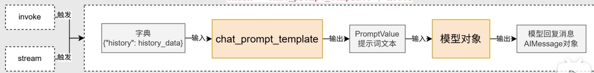
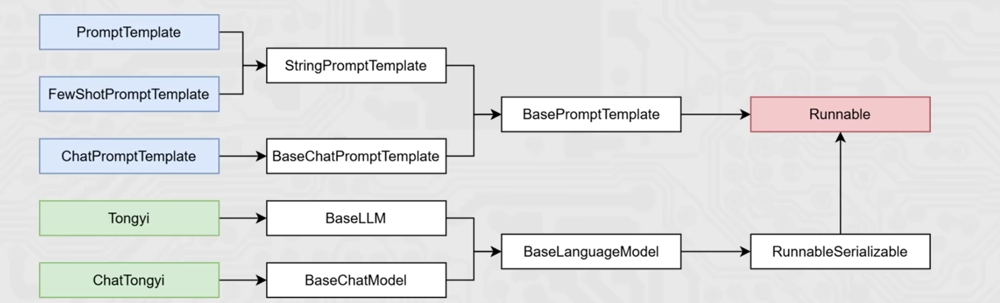

# Chain链式调用详解

## 一个真实的开发困境

你有没有遇到过这种情况：写了一段AI应用的代码，结果满屏都是嵌套调用、变量传递、错误处理，看起来像一团乱麻？

比如我要实现一个简单的问答功能，代码可能是这样的：

```python
# 先构建提示词
template = "请回答以下问题：{question}"
prompt = PromptTemplate(template=template, input_variables=["question"])

# 将提示词转为字符串
prompt_text = prompt.format(question=user_question)

# 调用模型
response = model(prompt_text)

# 处理模型响应
answer = response.content

# 还要处理各种边界情况
if not answer:
    answer = "抱歉，我无法回答这个问题"
```

这还只是一个最简单的场景。如果加入检索、加入多个模型调用、加一些条件判断，代码会变得极其复杂。这就是为什么我们需要Chain。

## 什么是Chain：不是新概念，是好设计

Chain这个词翻译过来是"链"，但与其说它是一项新技术，不如说它是一种**好的设计思想**。

想象一下工厂里的流水线：原材料从一端进入，经过多个工序的加工，最终变成成品从另一端出来。每个工序只做一件事，但串联起来就能完成复杂的任务。

Chain就是这个思想在AI应用开发中的体现：**把一个复杂的任务分解成多个简单的步骤，然后把它们串起来。**



从图中可以看到，用户的问题进入后，经过提示词模板的转换、模型的调用，最后输出答案。整个过程是一个连续的"流"，而不是一堆散落的代码块。

## 为什么需要Chain：三个真实的痛点

### 痛点一：代码难以维护

没有Chain的时候，每个步骤都可能耦合在一起。某天产品经理说"要在调用模型之前加个校验"，你得在密密麻麻的代码里找到那个位置，小心翼翼地修改，还可能影响其他功能。

有了Chain，你只需要：

```python
# 在链条中插入一个新步骤
chain = prompt | validator | model | parser
```

只需要改这一行，其他代码不用动。

### 痛点二：难以复用

比如你的产品里有三个地方都要用"生成产品描述"的功能。没有Chain的时候，你得在三个地方复制粘贴同样的代码。某天你优化了这个功能，得在三个地方重新改一遍。

有了Chain，你可以把这个功能定义成一个Chain，然后在三个地方复用：

```python
product_desc_chain = product_prompt | model | desc_parser

# 三处复用
result1 = product_desc_chain.invoke({"product": "手机"})
result2 = product_desc_chain.invoke({"product": "电脑"})
result3 = product_desc_chain.invoke({"product": "耳机"})
```

### 痛点三：错误处理混乱

在嵌套的函数调用中，错误不知道从哪里冒出来，也不知道该在哪里处理。Chain提供了统一的错误处理机制：

```python
chain = prompt | model | parser

try:
    result = chain.invoke({"input": "..."})
except Exception as e:
    # 统一在这里处理
    logger.error(f"Chain执行失败: {e}")
```

## Chain的核心：Runnable继承体系

理解Chain的关键在于理解它的设计基础——Runnable继承体系。很多人看这个继承图会觉得枯燥，但它的设计其实非常精妙。



### 一切从Runnable开始

`Runnable`是整个体系的起点，它只定义了一个核心方法：`invoke`。不管是什么组件——模型也好、提示词模板也好、解析器也好——只要继承自Runnable，就意味着"这个东西可以被调用"。

这个设计的好处是什么？**统一了所有组件的接口**。

不管你是语言模型、提示词模板还是输出解析器，在Chain眼里都一样——都是可以被串联的东西。就像不管你是螺丝钉还是螺母，只要符合标准，就能被组装到一起。

### invoke vs format：两个方法的本质区别

在看继承图的时候，你可能会注意到有些类定义了`format`方法，有些定义了`invoke`方法。这两个方法的区别是什么？

**format方法是"变形"**：接收输入，返回字符串。它只是把模板中的占位符换成真实的值。

**invoke方法是"执行"**：接收输入，不仅处理输入，还可能产生输出。它是真正"跑起来"的那个方法。

打个比方：format像是准备食材，按照食谱把该切的切好、该称的称好；invoke像是开始做菜，把这些食材变成一盘能吃的东西。

在Chain中，只有能"执行"的组件才能被串联起来，这就是为什么提示词模板被设计成继承自Runnable——它虽然主要做format的工作，但为了让Chain能够统一处理，它也实现了invoke方法（在invoke里调用format）。

### 继承体系的精妙之处

看看继承图的最右边：PromptTemplate、FewShotPromptTemplate、ChatPromptTemplate都继承自BasePromptTemplate，而BasePromptTemplate又继承自BasePromptTemplate（这可能是图中的一个标注错误，实际应该是BasePromptTemplate继承自某个中间类）。

这意味着什么？

意味着这三种提示词模板在Chain看来是"同一种东西"。你可以随意替换：

```python
# 替换提示词模板，就像换零件一样简单
chain1 = PromptTemplate(...) | model | parser  # 用简单模板
chain2 = FewShotPromptTemplate(...) | model | parser  // 换成少样本模板
chain3 = ChatPromptTemplate(...) | model | parser  # 换成聊天模板
```

这就是继承设计的威力：**定义好接口，制定好规范，然后让具体实现去遵循它们**。

## 链式调用的工作过程：一步一步看

理解了继承体系，我们再来看Chain是怎么工作的。

### 第一步：触发

所有的一切都从`invoke`开始。当你调用：

```python
result = chain.invoke({"question": "什么是RAG？"})
```

发生了什么？Chain的invoke方法被触发了。

### 第二步：传递

Chain拿到输入后，不是自己处理，而是把输入传递给链条中的第一个组件——提示词模板。

提示词模板处理完后，把结果（一个PromptValue）传给下一个组件——模型。

模型处理完，把结果（AIMessage）传给再下一个组件——解析器。

这个过程就像接力赛，每一棒只跑自己的那段，然后把接力棒交给下一棒。

### 第三步：组装

Chain怎么知道谁接谁？这要归功于`|`运算符：

```python
chain = prompt | model | parser
```

这个运算符是LangChain定义的，它把三个组件串联成一个执行序列。当你用`|`连接A和B的时候，LangChain知道你想要的是"先A后B"，并且知道A的输出会自动成为B的输入。

### 第四步：返回

最后一个组件处理完，把结果一层层传回来。你在`chain.invoke()`这一行得到的就是最终结果。

整个过程有点像水流：从源头（用户输入）流进来，经过多个处理节点（各种组件），最后从出口（最终输出）流出去。

## 解析器：Chain中的"翻译官"

解析器是Chain中容易被忽视但非常重要的组件。

### 它解决什么问题

模型输出的是原始文本或者消息对象，可能长这样：

```
AIMessage(content='根据您的问题，答案是RAG是一种检索增强生成技术...', additional_kwargs={}, example=False)
```

但你的代码可能需要的是一个Python字典、一个JSON、或者只是一个字符串。

解析器就是干这个"翻译"工作的：把机器输出的东西，翻译成你需要的格式。

### 常见的解析器

**StringOutputParser**：把输出转成纯文本，最简单的一种。

**JsonOutputParser**：把输出解析成JSON。如果你让模型"以JSON格式返回"，用这个解析器就很合适。

**PydanticOutputParser**：用Pydantic模型来验证和解析输出。这个很强大——你可以定义一个数据类，解析器会确保模型输出符合这个数据类的结构，不符合就报错。

### 解析器在Chain中的位置

解析器通常放在Chain的最后，因为它的任务就是处理模型的原始输出：

```python
chain = prompt | model | parser
#                 ^^^^^^ 解析器在这里，处理模型的输出
```

## 实际案例：一步步构建Chain

让我通过一个实际案例，展示Chain是如何解决真实问题的。

### 需求

做一个产品信息提取功能：输入产品描述，让AI提取出产品名称、价格、特点。

### 不用Chain的写法

```python
# 步骤1：构建提示词
template = """从以下文本中提取产品信息，返回JSON格式：
{text}

必须包含：name（产品名）、price（价格）、features（特点列表）"""

# 步骤2：准备输入
prompt = PromptTemplate(template=template, input_variables=["text"])
prompt_text = prompt.format(text="苹果最新款iPhone 15 Pro Max手机，售价9999元，配备A17芯片，拍照效果出色，电池续航持久。")

# 步骤3：调用模型
response = model.invoke(prompt_text)

# 步骤4：处理输出
raw_output = response.content

# 步骤5：解析JSON（还得自己写解析逻辑）
import json
info = json.loads(raw_output)

# 步骤6：验证和转换
if "price" in info and isinstance(info["price"], str):
    info["price"] = float(info["price"].replace("元", ""))

print(info)
```

这还只是单链，如果有分支、有条件、有错误处理，代码会乱成一团。

### 用Chain的写法

```python
from langchain.prompts import PromptTemplate
from langchain.output_parsers import JsonOutputParser
from pydantic import BaseModel, Field
from typing import List

# 1. 定义输出结构
class ProductInfo(BaseModel):
    name: str = Field(description="产品名称")
    price: float = Field(description="产品价格，单位元")
    features: List[str] = Field(description="产品特点列表")

# 2. 创建解析器
parser = JsonOutputParser(pydantic_object=ProductInfo)

# 3. 创建提示词模板
prompt = PromptTemplate(
    template="从以下文本中提取产品信息：\n{text}\n\n{format_instructions}",
    input_variables=["text"],
    partial_variables={"format_instructions": parser.get_format_instructions()}
)

# 4. 组装Chain
chain = prompt | model | parser

# 5. 执行
result = chain.invoke({
    "text": "苹果最新款iPhone 15 Pro Max手机，售价9999元，配备A17芯片，拍照效果出色，电池续航持久。"
})

# result直接就是ProductInfo对象，可以直接用
print(f"产品名: {result.name}")
print(f"价格: {result.price}")
print(f"特点: {result.features}")
```

看，代码清晰多了。而且解析器会确保输出符合ProductInfo的结构，不符合就报错，不用我们手动验证。

### Chain的复用

这个ProductInfo提取的Chain，可以在很多地方复用：

```python
# 定义一次，复用多次
product_info_chain = product_prompt | model | parser

# 用在手机描述提取
phone_info = product_info_chain.invoke({
    "text": "iPhone 15 Pro Max，售价9999元..."
})

# 用在电脑描述提取
laptop_info = product_info_chain.invoke({
    "text": "MacBook Pro M3，售价19999元..."
})

# 用在耳机描述提取
earphone_info = product_info_chain.invoke({
    "text": "AirPods Pro 2，售价1899元..."
})
```

## Chain的高级用法

### 动态选择Chain

有时候我们需要根据输入决定使用哪个Chain：

```python
from langchain.chains import Chain

class ConditionalChain(Chain):
    def _call(self, inputs):
        query_type = inputs.get("type")

        if query_type == "product":
            return self.product_chain.invoke(inputs)
        elif query_type == "service":
            return self.service_chain.invoke(inputs)
        else:
            return self.default_chain.invoke(inputs)
```

### 并行执行

有些步骤可以并行执行来提升性能：

```python
from langchain.schema import RunnableParallel

# 两个独立的处理可以并行
parallel_chain = RunnableParallel({
    "context": retriever,
    "question": lambda x: x["question"]
})

# 然后合并结果
full_chain = parallel_chain | prompt | model | parser
```

### 回退机制

当主Chain失败时，使用备用的：

```python
from langchain.chains import Chain

class FallbackChain(Chain):
    def __init__(self):
        self.main_chain = primary_chain
        self.fallback_chain = fallback_chain

    def _call(self, inputs):
        try:
            return self.main_chain.invoke(inputs)
        except Exception:
            return self.fallback_chain.invoke(inputs)
```

## Chain的局限性和应对

Chain不是银弹，它有自己的局限性。

### 局限性一：调试困难

当Chain执行失败时，定位问题可能比较困难——是提示词写得不对？还是模型出了问题？还是解析器处理不了输出？

**应对方法**：
- 把Chain拆成小段，每段单独测试
- 在关键节点加日志
- 使用`stream`方法逐步看输出

```python
# 逐步stream可以看到中间输出
for step in chain.stream({"input": "..."}):
    print(step)
```

### 局限性二：长链性能差

Chain越长，经过的组件越多，延迟也越高。

**应对方法**：
- 评估哪些步骤可以并行
- 考虑简化流程，合并步骤
- 使用缓存

### 局限性三：类型转换的坑

有时候前一个组件的输出格式和后一个组件期望的输入格式不匹配，Chain会报错。

**应对方法**：
- 仔细阅读文档，了解每个组件的输入输出类型
- 使用类型提示
- 必要时写自定义转换组件

```python
# 如果某个组件输出格式不对，可以加个转换
def transform(x):
    return {"text": x["content"]}

chain = prompt | model | transform | parser
```

## 总结：Chain教会我们什么

Chain不仅仅是一个技术实现，更是一种**思考问题的方式**。

它告诉我们：
- **复杂问题可以分解**：再大的任务，也可以分成一个个简单的步骤
- **简单组件可以复用**：把常用的步骤封装起来，下次直接用
- **接口统一很重要**：定义好接口，具体实现可以灵活替换
- **设计影响可维护性**：好的设计让代码易于修改和扩展

掌握Chain的思想，不仅仅是学会用LangChain，更是学会了一种分解问题、组合解决方案的思维方式。这种思维方式，在软件开发的各个领域都是通用的。

所以，下次当你面对一个复杂的AI任务时，不妨先想想：能不能把它拆成几步？每一步的输入输出是什么？然后用Chain把它们串起来。